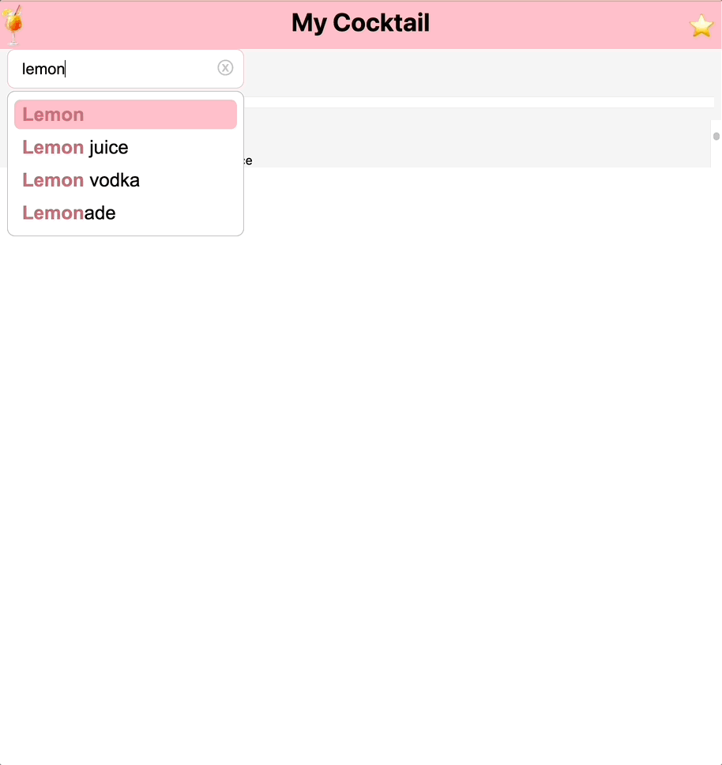

# [Today's Cocktail](https://cocktail-vercel-com.vercel.app/)

## Quick Start

```
git clone https://github.com/jiseung-kang/cocktail.vercel.com.git
cd cocktail.vercel.com
npm install
npm run dev 
```

## **🚪** Overview

[The CocktailDB API](https://www.thecocktaildb.com/)를 활용한 검색한 재료로 만들 수 있는 칵테일을 추천해주는 서비스입니다. 

## **Tech Stack**
`Next.js`, `TypeScript`, `SWR`, `Styled-Components`, `Vercel`

## **Feature**

- 재료 자동완성 기능을 제공합니다. 키보드 및 마우스를 이동해 재료를 선택할 수 있습니다.


- 태그 리스트를 제공합니다. 박스 입력 및 마우스 클릭으로 태그를 추가하거나 태그를 다시 눌러 삭제할 수 있습니다.    


- 검색된 칵테일에 대해 자연스러운 무한 스크롤이 구현되어 있습니다. 페이지 이동 시 위치를 기억합니다.


- 즐겨찾기에 칵테일을 추가하고 삭제할 수 있습니다.    

